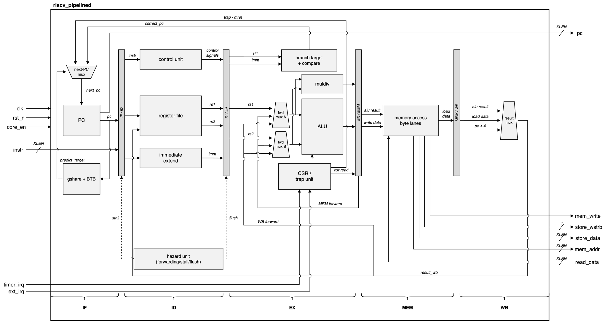

# riscv-pipelined

[](https://github.com/drewbabel/riscv-pipelined/actions/workflows/ci.yml)

A five-stage pipelined RV32IM processor in SystemVerilog that runs CoreMark on a Digilent Basys 3, with:

- Operands forwarded from MEM and WB, with a one-cycle interlock on the load-use hazard.
- A gshare predictor and branch target buffer that redirect fetch ahead of resolution in EX.
- Multiply on a DSP block and divide on an iterative shift-subtract unit.
- A direct-mapped instruction cache and a four-way set-associative write-back data cache with tree pseudo-LRU replacement, both with four-word lines fronting main memory.
- Machine mode covering traps, `mtvec` dispatch, the CLINT timer interrupt, an external interrupt line the UART receiver raises, and the Zicsr instructions.
- A UART bootloader that streams programs to the board, alongside memory-mapped peripherals.



## Performance

### CoreMark

Compiled at `-O2` and measured on the board at each configuration's clock.

| Configuration | Clock | CoreMark/sec | CoreMark/MHz |
|---------------|-------|--------------|--------------|
| Pipelined RV32IM, gshare, caches, 20-cycle memory model | 50.0 MHz | 76.56 | 1.53 |
| [Pipelined RV32IM, gshare branch predictor](https://github.com/drewbabel/riscv-pipelined/releases/tag/v2.1-gshare) | 33.3 MHz | 99.37 | 2.98 |
| [Pipelined RV32IM, hardware multiply and divide](https://github.com/drewbabel/riscv-pipelined/releases/tag/v2.0-rv32im) | 33.3 MHz | 83.36 | 2.50 |
| [Pipelined RV32I, software multiply and divide](https://github.com/drewbabel/riscv-pipelined/releases/tag/v2.0-rv32im) | 33.3 MHz | 32.09 | 0.96 |
| [Single-cycle RV32I baseline](https://github.com/drewbabel/riscv-single-cycle) | 20.0 MHz | 27.85 | 1.39 |

The current configuration's clock is Vivado-2026.1-signed timing, with 1.255 ns of worst setup slack. The four historical configurations' clocks are the rates their boards actually ran at, since the multicycle-exception flow that signs the row above cannot close timing on their ungated 100 MHz registers at any clock.

### Embench

All 19 benchmarks run at `-O2` and `GLOBAL_SCALE_FACTOR=1`. The pipelined core runs RV32IM and the single-cycle core runs RV32I with the libgcc soft multiply.

| Benchmark | Single-cycle cycles | Pipelined cycles | Speedup | Explanation |
|---|---|---|---|---|
| `aha-mont64` | 12,747,113 | 10,258,848 | 1.24 | Hardware multiply outweighs the stall cycles |
| `crc32` | 5,746,547 | 8,012,302 | 0.72 | Load-use stalls with no multiplies to win back |
| `depthconv` | 54,305,013 | 8,513,186 | 6.38 | Each accumulate pays a soft-multiply call on RV32I |
| `edn` | 68,368,034 | 8,423,854 | 8.12 | Soft-multiply calls dominate the RV32I run |
| `huffbench` | 2,381,259 | 5,224,182 | 0.46 | Mispredicted data-dependent branches |
| `matmult-int` | 24,655,071 | 7,781,946 | 3.17 | Hardware multiply in the inner loop |
| `md5sum` | 3,139,462 | 6,449,322 | 0.49 | Serial shift and xor chains leave only stall cost |
| `nettle-aes` | 4,402,665 | 10,017,204 | 0.44 | Stalling table loads with nothing to win back |
| `nettle-sha256` | 4,991,165 | 10,355,678 | 0.48 | Rotate and xor rounds pay only stall cost |
| `nsichneu` | 2,242,269 | 15,417,712 | 0.15 | Code outgrows the icache, 13.8% of fetches miss |
| `picojpeg` | 3,346,409 | 6,549,516 | 0.51 | Bit-reading branches outweigh the multiply savings |
| `qrduino` | 4,892,213 | 6,283,296 | 0.78 | Multiply savings partly offset the mispredicts |
| `sglib-combined` | 2,799,761 | 6,180,216 | 0.45 | Pointer-chasing loads stall back to back |
| `slre` | 2,809,560 | 6,527,320 | 0.43 | A data-dependent branch per character |
| `statemate` | 2,377,657 | 6,540,378 | 0.36 | Dense unpredictable branches |
| `tarfind` | 6,101,114 | 5,148,026 | 1.19 | Hardware multiply in the benchmark loop |
| `ud` | 6,415,329 | 7,215,180 | 0.89 | Kernel divides nearly offset the stalls |
| `wikisort` | 7,497,378 | 7,383,034 | 1.02 | Hardware divide and remainder offset the stalls |
| `xgboost` | 3,506,538 | 12,333,828 | 0.28 | Data outgrows the dcache, 22.3% of accesses miss |

### Memory hierarchy

The Basys 3 has no DRAM, so `mem_delay` emulates a main memory in block RAM, parameterized by latency and completing through a ready handshake. The cache rows below are measured on the board at a divide-by-4 core enable, with ticks and hit rates identical to simulation. A 200-iteration run validates the CRCs on hardware over 12.8 seconds.

| Configuration | Total ticks | Iterations/sec | Instruction cache | Data cache |
|---|---|---|---|---|
| No caches, single-cycle memory | 845,818 | 39.41 | | |
| Caches, 1-cycle memory | 1,597,690 | 20.86 | 99.8% hit | 99.6% hit |
| Caches, 20-cycle memory | 1,610,380 | 20.70 | 99.8% hit, 2.04 cycle AMAT | 99.6% hit, 2.08 cycle AMAT |

A 20x increase in memory latency costs 0.8%, where every uncached access would pay roughly 21 cycles. Hit latency accounts for the remaining gap to the uncached figure, since both controllers spend a cycle in `IDLE` before `COMPARE`.

## Verification

| Method | Scope |
|--------|-------|
| riscv-formal under SymbiYosys | Every retired instruction against RV32I + M divides, machine-mode traps, Zicsr, misaligned access |
| SymbiYosys unit proofs | `muldiv` products + handshake, `csr` interrupt path by k-induction, `hazard_unit` forwarding + stall + flush |
| Spike lockstep co-simulation | Every retired instruction of a directed RV32IM program + a randomized regression |
| Reference-model testbenches | Every module, plus directed pipeline programs and FreeRTOS and CoreMark boots |
| Basys 3 | Full system integration, CoreMark CRCs on hardware |

A 32-bit multiplier is beyond in-core bounded model checking, and `insn_mul` is excluded from riscv-formal. `muldiv` proves its own products for every operand pair. The riscv-formal wrapper ties both interrupt lines low, and `formal/irq.sby` proves the trap logic separately. An interrupt is taken only when pending and enabled, a simultaneous exception outranks it, a simultaneous external and timer interrupt resolves to the external one, and `mret` restores `MIE` from `MPIE`.

## Implementation

Post-route utilization per instance from AMD Vivado 2026.1 on the Xilinx Artix-7 XC7A35T, reproducible with `vivado/impl.tcl`. `alu` and `hazard_unit` dissolve into the datapath during optimization, so they carry no standalone row.

| Instance | Logic LUTs | LUTRAM | Flip-flops | Block RAMs (18 Kb each) | DSPs |
|----------|------------|--------|------------|-------------------------|------|
| `uart_ctrl` | 3 | 0 | 11 | 0 | 0 |
| `gpio` | 8 | 0 | 16 | 0 | 0 |
| `tick_gen` | 11 | 0 | 1 | 0 | 0 |
| `dmem` \* | 21 | 0 | 148 | 32 | 0 |
| `imem` \* | 23 | 0 | 20 | 32 | 0 |
| `gshare` | 25 | 64 | 10 | 0 | 0 |
| `uart_tx` | 30 | 0 | 27 | 0 | 0 |
| `pmu` | 32 | 0 | 0 | 0 | 0 |
| `uart_rx` | 46 | 0 | 30 | 0 | 0 |
| `clint` | 64 | 0 | 128 | 0 | 0 |
| `btb` | 100 | 76 | 64 | 0 | 0 |
| `boot_loader` | 111 | 0 | 93 | 0 | 0 |
| `icache` \* | 179 | 0 | 255 | 19 | 0 |
| `csr` | 225 | 0 | 382 | 0 | 0 |
| `regfile` | 645 | 0 | 992 | 0 | 0 |
| `muldiv` | 1872 | 0 | 239 | 0 | 15 |
| `dcache` \* | 1962 | 1792 | 1282 | 0 | 0 |
| `riscv_pipelined` | 3269 | 140 | 2366 | 0 | 15 |
| `board_top` (total) | 5747 | 1932 | 4381 | 51 | 15 |

\* Block RAM has no asynchronous read port. Every tag and data array is registered and single-ported, with valid and dirty packed into the tag word and a reset walk clearing the tags before the cache accepts a request. Block-RAM arrays are split into byte lanes, since nextpnr-xilinx misconfigures 9-bit block-RAM ports and every parity bit reads zero ([openXC7/nextpnr-xilinx#95](https://github.com/openXC7/nextpnr-xilinx/pull/95)). The data cache's shallow arrays use distributed RAM, and replacement state is kept in flip-flops.

### Timing

The board clock is 100 MHz and the core advances on a clock enable whose divisor sets the instruction rate. AMD Vivado 2026.1 meets every timing constraint on the full `board_top` design at a divide-by-2 enable, with 1.255 ns of worst setup slack and 0.034 ns of worst hold slack.

Paths between core registers carry a multicycle exception matching the enable cadence, and close with 1.331 ns to spare. Worst slack is set by the clock-enable distribution network, which is single-cycle by construction and is the one path class the exception does not cover. Running `vivado/impl.tcl 2` reproduces the figures above.

## Building and running

```
make MOD=alu                                # run a module's testbench
make vsim MOD=coremark_boot                 # fast two-state Verilator run of a long testbench
make wave MOD=board_top                     # run the testbench and open the waveform in Surfer
make formal MOD=hazard_unit                 # run a module's SymbiYosys proof
make trace MOD=hazard_unit                  # print a formal counterexample as text
make view-formal MOD=hazard_unit            # open a formal waveform in Surfer
bash formal/rvfi/run.sh                     # run the full riscv-formal proof of the core
make cosim PROG=cosim_m                     # lockstep-compare an rv32im program against Spike
python3 tests/send_prog.py PORT prog.hex    # stream a program to the board over UART
./build_board.sh 4 flash                    # build the bitstream at divide-by-4 and flash
```

`build_board.sh` preserves the `pc_plus4` nets with `setattr -set keep 1 w:*pc_plus4*`, because the Yosys `xilinx_srl` pass otherwise drops the clock enable on the `pc_plus4` shift register ([YosysHQ/yosys#6059](https://github.com/YosysHQ/yosys/pull/6059)). `gate_check.sh` re-verifies the workaround after any toolchain change.

### Tool versions

Icarus Verilog 13.0, Verilator 5.050, Yosys 0.66, SymbiYosys 0.66 driving btormc and Yices 2, sv2v 0.0.13, nextpnr-xilinx 0.8.2, the RISC-V GNU toolchain (`riscv64-elf-gcc` 16.1.0), Python 3.11, and Surfer.
